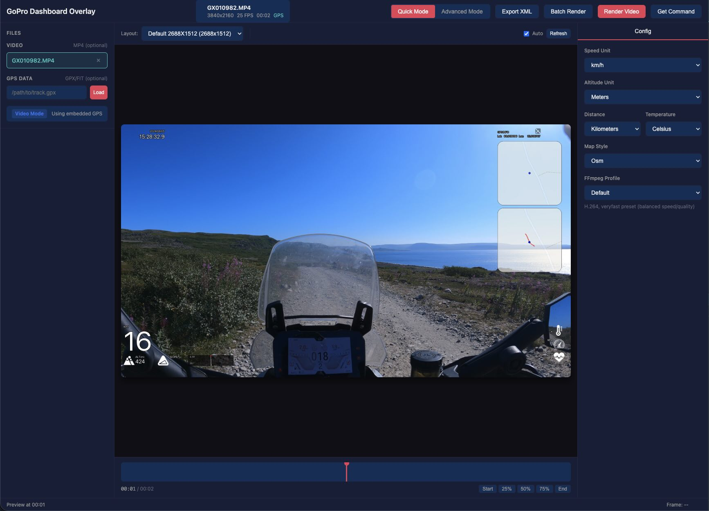
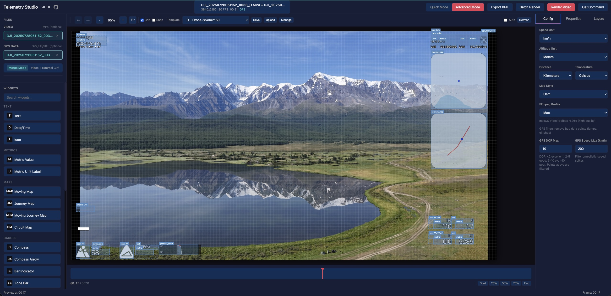
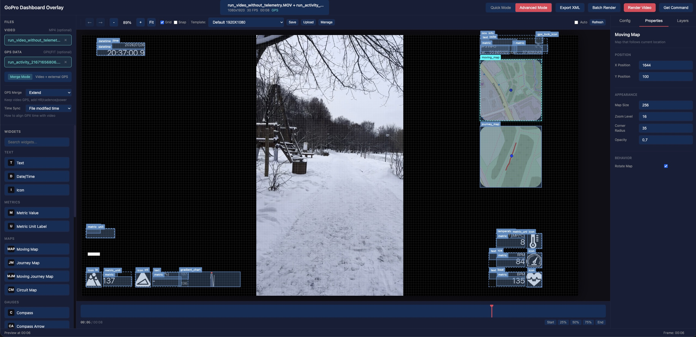
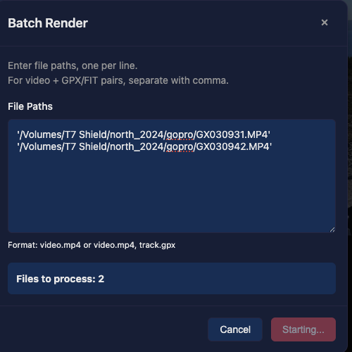
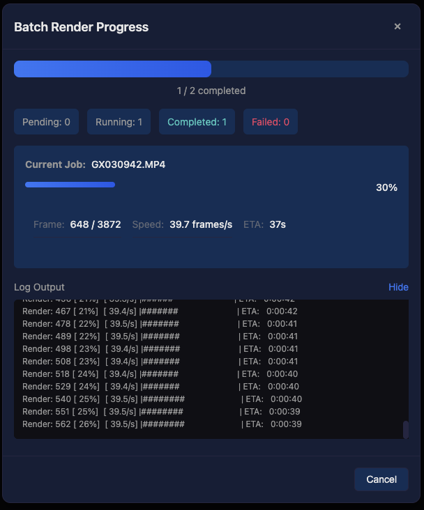

# Telemetry Studio

[](https://www.python.org/downloads/)
[](https://www.gnu.org/licenses/gpl-3.0)

A visual web interface for creating video overlays with GPS telemetry data. Wraps the powerful [gopro-overlay](https://github.com/time4tea/gopro-dashboard-overlay) library with an intuitive UI.

## Features

- **Quick Mode** — Select from predefined layouts, customize units and map styles
- **Advanced Mode** — Visual drag-and-drop editor for creating custom overlay layouts
- **Live Preview** — See your overlay in real-time as you configure it
- **DJI Drone Support** — Automatic SRT telemetry parsing with timezone and time alignment auto-detection
- **Non-GoPro Video Support** — Use any video with external GPX/FIT/SRT files for GPS data
- **Vertical Video Support** — Automatic rotation detection and correct overlay rendering
- **GPS Quality Analysis** — Automatic signal quality check with warnings before rendering
- **Template Management** — Save and load custom templates
- **Batch Rendering** — Process multiple files with the same settings
- **Background Jobs** — Render videos in the background with progress tracking

## Screenshots

### Quick Mode

Simple configuration with predefined layouts. Perfect for quick renders.



### Advanced Mode

Full visual editor with drag-and-drop widgets. Create custom layouts with complete control.


### DJI Drone Support

Use DJI drone videos with SRT telemetry files. Timezone offset and time alignment are automatically detected from video metadata, supporting different DJI models and firmware versions.



### External GPX & Vertical Video

Use any video with external GPX/FIT files. Vertical videos are automatically detected and rendered correctly.



### Batch Rendering

Process multiple videos at once with the same overlay settings.

<p align="center">


</p>

## Requirements

- Python 3.14+
- FFmpeg (must be installed and available in PATH)
- [gopro-overlay](https://pypi.org/project/gopro-overlay/) (installed automatically)

## Installation

```bash
# Install uv if not already installed
curl -LsSf https://astral.sh/uv/install.sh | sh

# Clone the repository
git clone https://github.com/Romancha/telemetry-studio.git
cd telemetry-studio

# Install dependencies
uv sync

# Run the application
uv run telemetry-studio

# Or with custom host/port
uv run telemetry-studio --host 127.0.0.1 --port 8080
```

Then open http://localhost:8000 in your browser.

### Supported Input Files

| Type | Formats | Description |
|------|---------|-------------|
| Video | `.mp4`, `.mov`, `.avi` | Video files (GoPro files may contain embedded GPS) |
| GPS Data | `.gpx`, `.fit`, `.srt` | External GPS tracks — GPX, FIT, or DJI SRT telemetry (optional) |

## Configuration

Environment variables (prefix: `TELEMETRY_STUDIO_`):

| Variable | Default | Description |
|----------|---------|-------------|
| `HOST` | `0.0.0.0` | Server host |
| `PORT` | `8000` | Server port |
| `LOCAL_MODE` | `true` | Use local file paths instead of uploads |
| `TEMPLATES_DIR` | `~/.telemetry-studio/templates` | Custom templates directory |
| `ENABLE_GOPRO_PATCHES` | `true` | Enable runtime patches for gopro-overlay |
| `USE_WRAPPER_SCRIPT` | `true` | Use wrapper script for rendering |

You can also use a `.env` file in the project root.

## Runtime Patches

Telemetry Studio includes runtime patches for `gopro-overlay` that add:

- **Timecode preservation** — Maintains original video timecode for Final Cut Pro compatibility
- **Audio stream copy** — Preserves audio without re-encoding
- **Metadata preservation** — Keeps original video metadata in output

Patches are applied automatically at startup. To disable:

```bash
export TELEMETRY_STUDIO_ENABLE_GOPRO_PATCHES=false
export TELEMETRY_STUDIO_USE_WRAPPER_SCRIPT=false
```

## Development

```bash
# Install with dev dependencies
uv sync --all-extras

# Run linting
uv run ruff check src tests
uv run ruff format src tests

# Run tests
uv run pytest

# Run E2E tests (requires Playwright)
uv run playwright install chromium
uv run pytest tests/e2e/ -v
```

### Project Structure

```
src/telemetry_studio/
├── main.py          # CLI entry point
├── app.py           # FastAPI application
├── config.py        # Settings
├── api/             # API routers
├── models/          # Pydantic data models
├── services/        # Business logic
└── static/          # Frontend assets
```

## Contributing

Contributions are welcome! Please feel free to submit a Pull Request.

1. Fork the repository
2. Create your feature branch (`git checkout -b feature/amazing-feature`)
3. Commit your changes (`git commit -m 'Add some amazing feature'`)
4. Push to the branch (`git push origin feature/amazing-feature`)
5. Open a Pull Request

## License

This project is licensed under the GPL-3.0 License - see the [LICENSE](LICENSE) file for details.

## Acknowledgments

- [gopro-dashboard-overlay](https://github.com/time4tea/gopro-dashboard-overlay) — The underlying overlay rendering engine
